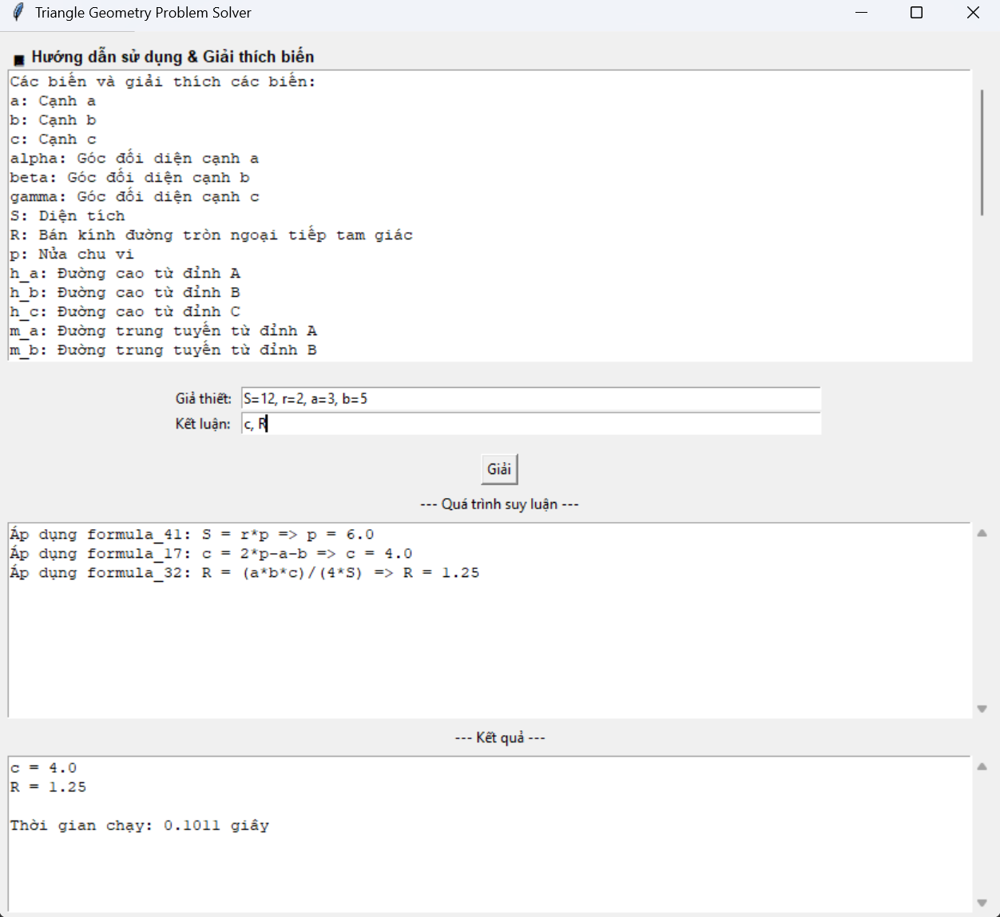
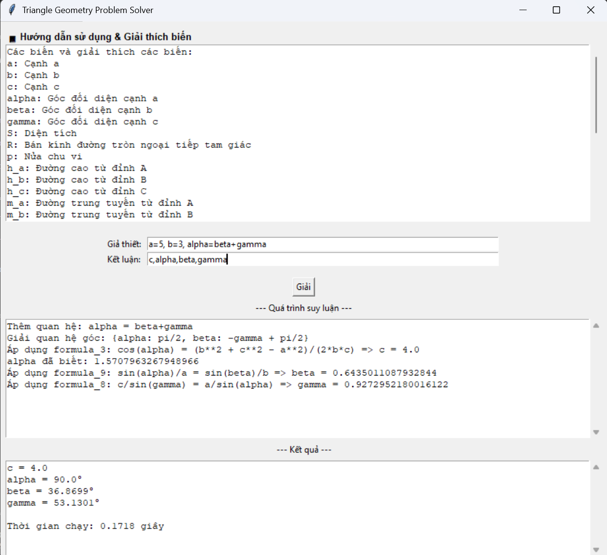

# Triangle Geometry Solver

Một hệ thống giải toán tam giác thông minh được viết bằng Python, hỗ trợ giải các bài toán hình học phẳng liên quan đến tam giác với giao diện đồ họa và dòng lệnh.

## 🚀 Tính năng chính

### 📐 Hỗ trợ đầy đủ các đại lượng tam giác
- **Cạnh**: `a`, `b`, `c`
- **Góc**: `alpha`, `beta`, `gamma` (nhập theo độ, tự động chuyển sang radian)
- **Diện tích**: `S`
- **Bán kính đường tròn ngoại tiếp**: `R`
- **Nửa chu vi**: `p`
- **Đường cao**: `h_a`, `h_b`, `h_c`
- **Đường trung tuyến**: `m_a`, `m_b`, `m_c`
- **Đường phân giác**: `p_a`, `p_b`, `p_c`
- **Bán kính đường tròn nội tiếp**: `r`, `r_a`, `r_b`, `r_c`

### 🧠 Thuật toán thông minh
- **Backward Chaining**: Tìm kiếm ngược từ kết luận về giả thiết
- **Hệ thống công thức tự động**: Tự động sinh ra các công thức nghịch đảo
- **Giải hệ phương trình**: Xử lý các bài toán phức tạp
- **Kiểm tra tính hợp lệ**: Đảm bảo tam giác tồn tại và có nghĩa

### 🎯 Hỗ trợ các loại tam giác
- **Tam giác thường**: Tam giác bất kỳ
- **Tam giác vuông**: Có góc 90°
- **Tam giác cân**: Có 2 cạnh bằng nhau
- **Tam giác đều**: Có 3 cạnh bằng nhau

## 📦 Cài đặt

### Yêu cầu hệ thống
- Python 3.7+
- SymPy (thư viện toán học)
- Tkinter (cho giao diện đồ họa)

### Cài đặt dependencies
```bash
pip install -r requirements.txt
```

## 🎮 Cách sử dụng

### Giao diện đồ họa (GUI)
```bash
python main.py
```

### Dòng lệnh (CLI)
Bỏ comment phần `main()` trong file `main.py` và comment phần `run_gui()`.

## 📝 Cú pháp đầu vào

### Giả thiết (Hypotheses)
Nhập các giá trị đã biết, phân cách bằng dấu phẩy:
```
a=3, b=4, c=5
a=5, b=5, alpha=60
a=3, b=4, gamma=90
```

### Kết luận (Conclusions)
Nhập các đại lượng cần tìm, phân cách bằng dấu phẩy:
```
S, R
c, alpha, beta
h_a, m_a, p_a
```

### Ví dụ phức tạp
```
# Giả thiết với biểu thức
a=4, b=3, c=2*a, alpha=beta+10, beta=50

# Kết luận nhiều đại lượng
c, alpha, gamma, S, R, r
```

## 🔧 Các công thức được hỗ trợ

### Định lý cơ bản
- **Định lý cosin**: `a² = b² + c² - 2bc·cos(α)`
- **Định lý sin**: `a/sin(α) = b/sin(β) = c/sin(γ)`
- **Tổng góc**: `α + β + γ = π`

### Công thức diện tích
- **2 cạnh và góc xen giữa**: `S = (ab·sin(γ))/2`
- **Công thức Heron**: `S = √(p(p-a)(p-b)(p-c))`

### Đường đặc biệt
- **Đường cao**: `h_a = 2S/a`
- **Đường trung tuyến**: `m_a = √(2b² + 2c² - a²)/2`
- **Đường phân giác**: `p_a = 2bc·cos(α/2)/(b+c)`

### Đường tròn
- **Bán kính ngoại tiếp**: `R = abc/(4S)`
- **Bán kính nội tiếp**: `r = S/p`

## 🎨 Giao diện

### Màn hình chính
- **Hướng dẫn**: Hiển thị danh sách các biến và ý nghĩa
- **Nhập liệu**: Ô nhập giả thiết và kết luận
- **Quá trình suy luận**: Hiển thị từng bước giải
- **Kết quả**: Hiển thị giá trị cuối cùng

### Tính năng giao diện
- **Scroll text**: Hỗ trợ văn bản dài
- **Read-only**: Hướng dẫn không thể chỉnh sửa
- **Real-time**: Cập nhật kết quả ngay lập tức

### Giao diện Tkinter
Giao diện đồ họa được thiết kế thân thiện với người dùng, bao gồm:
- **Phần hướng dẫn**: Hiển thị đầy đủ danh sách biến và ý nghĩa
- **Ô nhập liệu**: Dễ dàng nhập giả thiết và kết luận
- **Khu vực hiển thị**: Chia thành 2 phần riêng biệt cho quá trình suy luận và kết quả
- **Nút giải**: Thực hiện tính toán ngay lập tức


*Giao diện khi giải bài toán tam giác vuông*


*Giao diện khi giải bài toán tam giác cân*

## 🔍 Ví dụ sử dụng

### Ví dụ 1: Tam giác vuông
```
Giả thiết: a=3, b=4, gamma=90
Kết luận: c, S, R
```
**Kết quả:**
- `c = 5.0`
- `S = 6.0`
- `R = 2.5`


### Ví dụ 2: Tam giác cân
```
Giả thiết: a=5, b=5, alpha=60
Kết luận: c, S, R, r
```
**Kết quả:**
- `c = 5.0`
- `S = 10.825`
- `R = 2.887`
- `r = 1.443`


### Ví dụ 3: Biểu thức phức tạp
```
Giả thiết: a=4, b=3, c=2*a, alpha=beta+10, beta=50
Kết luận: c, alpha, gamma, S
```
**Kết quả:**
- `c = 8.0`
- `alpha = 60.0°`
- `gamma = 70.0°`
- `S = 12.0`

## 🛠️ Kiến trúc code

### Các lớp chính
- **`TriangleSolver`**: Lớp chính xử lý logic giải toán
- **`TriangleSolverApp`**: Lớp giao diện đồ họa

### Các phương thức quan trọng
- **`_init_formulas()`**: Khởi tạo hệ thống công thức
- **`_backward_chain()`**: Thuật toán tìm kiếm ngược
- **`solve_triangle()`**: Phương thức giải chính
- **`is_valid_triangle()`**: Kiểm tra tính hợp lệ

## 🧪 Kiểm tra và debug

### Logging
Hệ thống tự động hiển thị:
- Các công thức được áp dụng
- Quá trình suy luận từng bước
- Thời gian thực thi
- Lỗi và cảnh báo

### Validation
- Kiểm tra bất đẳng thức tam giác
- Kiểm tra tổng góc bằng 180°
- Kiểm tra tính hợp lệ của góc và cạnh
- Phát hiện số phức và giá trị âm

## 🚀 Tính năng nâng cao

### Tự động sinh công thức
Hệ thống tự động tạo ra các công thức nghịch đảo từ công thức gốc:
```
Từ: S = (ab·sin(γ))/2
Tạo: a = 2S/(b·sin(γ))
     b = 2S/(a·sin(γ))
     γ = arcsin(2S/(ab))
```

### Xử lý biểu thức
Hỗ trợ các biểu thức phức tạp:
- Phép toán cơ bản: `+`, `-`, `*`, `/`
- Hàm lượng giác: `sin`, `cos`, `tan`
- Căn bậc hai: `sqrt()`
- Biến đại số: `2*a`, `beta+10`

## 📊 Hiệu suất

- **Thời gian giải**: Thường dưới 1 giây cho các bài toán cơ bản
- **Độ chính xác**: Sử dụng SymPy cho tính toán chính xác
- **Bộ nhớ**: Tối ưu cho các bài toán tam giác thực tế

## 🤝 Đóng góp

Nếu bạn muốn đóng góp vào dự án:
1. Fork repository
2. Tạo branch mới cho tính năng
3. Commit thay đổi
4. Tạo Pull Request

## 📄 License

Dự án này được phát hành dưới giấy phép MIT.

## 👨‍💻 Tác giả

Được phát triển như một công cụ hỗ trợ học tập và nghiên cứu hình học phẳng.

---

**Lưu ý**: Hệ thống được thiết kế để xử lý các bài toán tam giác thực tế. Các trường hợp đặc biệt hoặc tam giác suy biến có thể cần xử lý thêm.